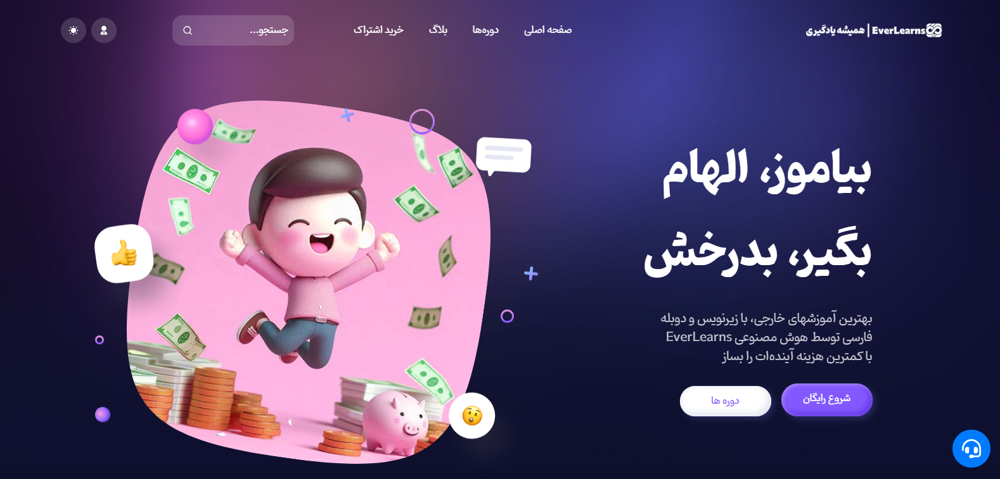
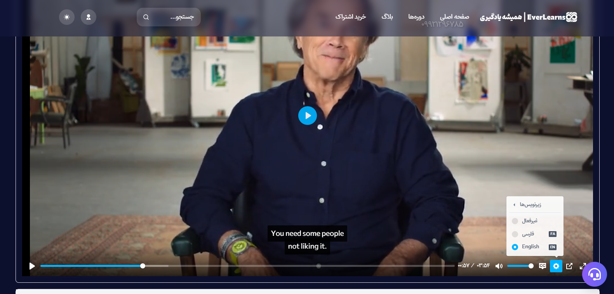
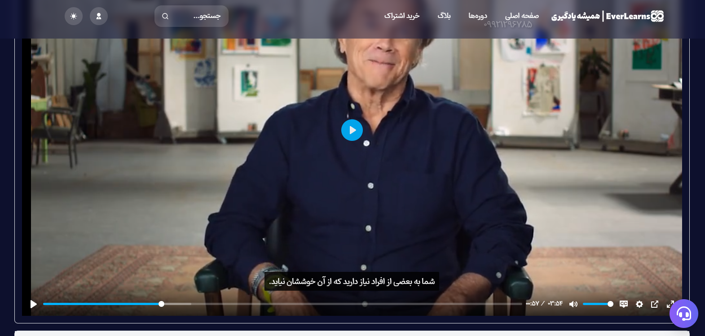
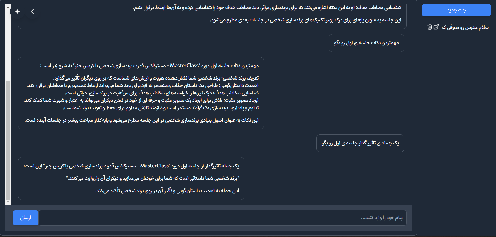
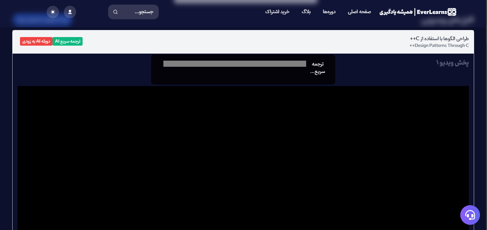
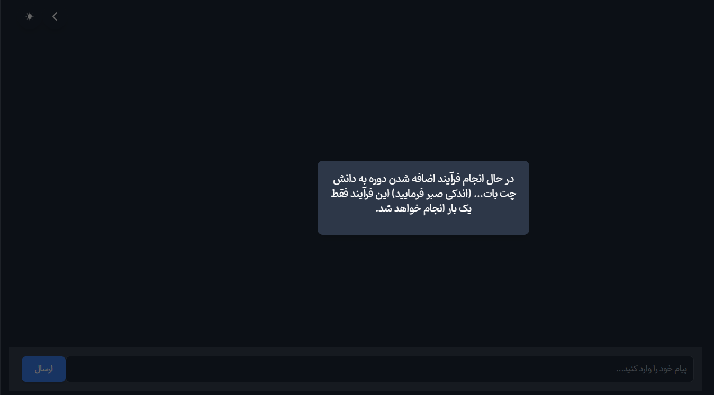

# EverLearns: educational platform showcase

EverLearns is a portfolio case study about an educational platform for Persian speakers studying English-language courses. This repository contains a product narrative and existing screenshots, **not application source**. It has no runnable backend/frontend, dependency manifest, tests or deployment workflow. Cloning it lets you inspect the presentation; it does not let you run or verify the product.

The product site named in the original presentation is `everlearns.ir`. This README does not verify its availability or the current feature set.

## Product scope and evidence

The original presentation describes English subtitle generation, Persian subtitle translation and a course-focused chat tutor. The screenshots illustrate those interfaces. They do not establish translation accuracy, response latency, instructor-level answers or production reliability.

The described tutor use cases include answering course questions, summarizing lessons, generating practice questions and discussing concepts. These are product claims in this case study, not capabilities reproduced by code or evaluated here. This repository contains no comparative translation benchmark, so it makes no claim of being better than Google Translate or another service.

### Subtitles and translation

The described flow starts when a learner opens a course: the system prepares English subtitles and Persian translations for that course. On-demand preparation is a product design described in the original narrative; no public implementation or cost measurements are included here.

### Course-focused tutor

The chat screens show a course-oriented interface and a preparation/loading state.

### On-demand preparation screens

The original narrative describes preparing subtitles and tutor context when first requested. These screens alone do not establish when processing runs or how much it costs.

The earlier narrative called this preparation "training a model for each course." There is no source code, training configuration or evaluation in this repository to support that description. It also does not establish whether the product uses retrieval-augmented generation, prompts with course context, fine-tuning or another approach. Retrieving course material at answer time is different from training model weights; neither mechanism is claimed as verified here. Chat-history retention and reuse are also not demonstrated by the public files.

## Reported technical background

The original project narrative names the following technologies. They describe the reported product stack, not dependencies or architecture inspectable in this repository:

- Backend: Python, FastAPI and PostgreSQL.
- AI integrations: OpenAI and NLP/translation pipelines; specific models and processing details are not documented here.
- Frontend: React and Tailwind CSS.
- Infrastructure: Docker, AWS Lambda and S3 for subtitle storage.

To turn this case study into runnable technical evidence would require authorized source, setup instructions, tests and documented data/model flows. None are supplied here, and the screenshots should not be read as a substitute for them.

## Team and contribution scope

The original presentation credits **Bizix Tech** (`bizix.tech`) and describes the portfolio owner's role as backend development and AI/API work. This repository records that attribution; it does not contain application code from which to assess the implementation or individual contribution independently.

## Licensing and reuse

Licensing is **undecided**. This repository contains no `LICENSE` file, so the previous MIT assertion has been removed. This README does not choose or grant a new license to the narrative, screenshots or any unpublished application code. Do not assume that public visibility gives permission to reuse these materials; ask the owner before reuse.

## Feedback

Issues or documentation corrections can clarify this case study. There is no public application source here to contribute backend or frontend changes to. Existing screenshot links have been kept; this update adds no visual assets.
