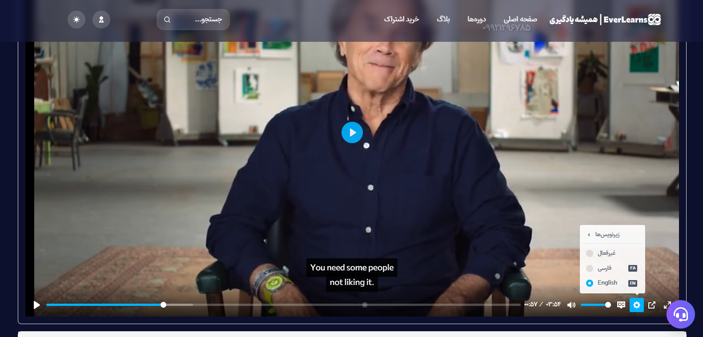

# EverLearns: AI-Powered Educational Platform

**EverLearns** is an innovative educational web application designed to enhance English learning experiences for Persian speakers using cutting-edge **artificial intelligence**. It automatically generates **English subtitles** and provides **real-time translations to Persian**, ensuring accurate and fluid translations tailored for professional courses.

### everlearns.ir
---

## Why EverLearns?

Traditional educational platforms for Persian speakers often lack reliable support for professional English courses, leaving learners with poor subtitles or none at all. **EverLearns** bridges this gap with two core innovations:

1. **AI-Generated Subtitles & Translations**:
   - Automatic generation of **English subtitles**.
   - High-quality **Persian translations**, far superior to basic Google Translate results.

2. **AI-Powered Virtual Tutor**:
   - Each course comes with a **custom AI chatbot** trained specifically for the course content.
   - The chatbot can:
     - Answer questions like an expert instructor.
     - Summarize lessons.
     - Generate practice questions.
     - Engage in discussions to clarify concepts.

---

## Features

### 1. Intelligent Subtitle Generation
- Converts course videos into **precise English subtitles**.
- Provides **fluid and contextual Persian translations** automatically.
- 
- 

### 2. Personalized AI Tutor
- The AI chatbot is trained specifically for each course when it’s first accessed.
- Users can:
  - Ask detailed questions.
  - Get summaries of lessons.
  - Solve complex problems with interactive discussions.
- - 

### 3. On-Demand Subtitle & Tutor Training
- Subtitles and AI tutors are created **on-demand** to reduce infrastructure costs.
- **How it works:**
  - Subtitles are generated only when a user starts a course.
  - The tutor is trained when the user interacts with it for the first time.
- 
- 

### 4. Addressing Key Problems
- **Subtitle Quality**: Overcomes the limitations of traditional translation systems.
- **Lack of Support**: AI ensures users always have access to reliable, round-the-clock assistance.

---

## How It Works

### Subtitle & Translation
1. User starts a course.
2. AI generates and stores **English subtitles**.
3. Subtitles are translated into **Persian** in real-time.

### AI Tutor
1. User interacts with the course's chatbot.
2. The model is trained on the course content (only once).
3. All interactions and improvements are stored for future sessions.

---

## Technologies Used

- **Backend**:
  - Python
  - FastAPI
  - PostgreSQL
- **AI Models**:
  - NLP and translation models (e.g., OpenAI, custom ML pipelines)
- **Frontend**:
  - React.js
  - TailwindCSS
- **Infrastructure**:
  - Docker
  - AWS Lambda
  - S3 for subtitle storage

---

## Challenges & Solutions

### Challenge 1: High Infrastructure Costs
- **Problem**: Running AI models for every course can become expensive with high API or local model costs.
- **Solution**: Implement **on-demand processing**:
  - Subtitles are generated only when the course is accessed.
  - AI tutors are trained when users first interact with them.

---

## Contributing

We welcome contributions! Feel free to fork the repository and submit pull requests. For major changes, please open an issue first to discuss the proposed changes.

---

## License

This project is licensed under the **MIT License**. See `LICENSE` for more details.

---

## About the Team

EverLearns is developed by the **Bizix Tech** team ([bizix.tech](https://bizix.tech)).  
**Role in Development**: Backend development and AI/API optimizations.
